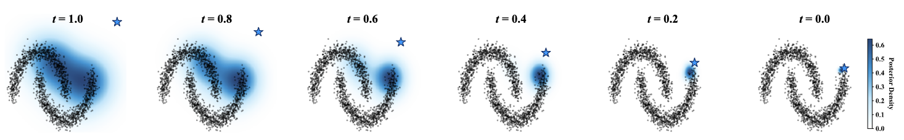
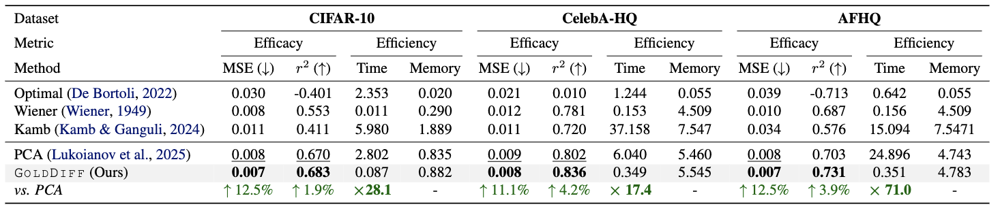
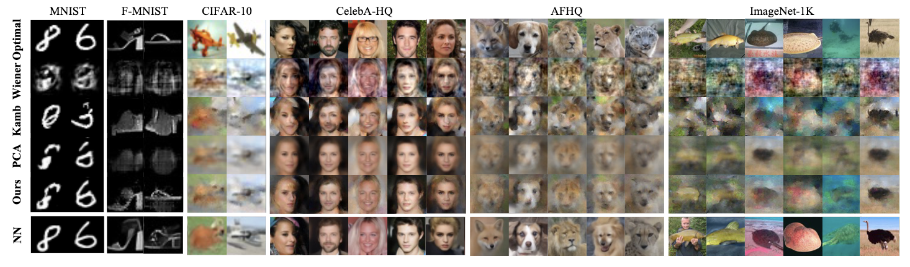

# Fast and Scalable Analytical Diffusion

[](LICENSE)
[](https://www.python.org/downloads/release/python-3100/)
[](https://arxiv.org/abs/2602.16498)
[](https://icml.cc/Conferences/2026)
[](https://github.com/shangxinyi/GoldDiff/issues)

Official implementation of our paper **[Fast and Scalable Analytical Diffusion](https://arxiv.org/abs/2602.16498)**.

> Accepted at ICML 2026.

---

## Abstract

Analytical diffusion models offer a mathematically transparent path to generative modeling by formulating the denoising score as an empirical-Bayes posterior mean. However, this interpretability comes at a prohibitive cost: the standard formulation necessitates a full-dataset scan at every timestep, scaling linearly with dataset size. In this work, we present the first systematic study addressing this scalability bottleneck. We challenge the prevailing assumption that the entire training data is necessary, uncovering the phenomenon of Posterior Progressive Concentration: the effective golden support of the denoising score is not static but shrinks asymptotically from the global manifold to a local neighborhood as the signal-to-noise ratio increases. Capitalizing on this, we propose Dynamic Time-Aware Golden Subset Diffusion (GoldDiff), a training-free framework that decouples inference complexity from dataset size. Instead of static retrieval, GoldDiff uses a coarse-to-fine mechanism to dynamically pinpoint the "Golden Subset" for inference. Theoretically, we derive rigorous bounds guaranteeing that our sparse approximation converges to the exact score while avoiding spurious influence. Empirically, GoldDiff achieves a 71× speedup on AFHQ while matching or even surpassing full-scan baselines. Most notably, we demonstrate the first successful scaling of analytical diffusion to ImageNet-1K, unlocking a scalable, training-free paradigm for large-scale generative modeling.

We illustrate this phenomenon on the Moons distribution below: as the diffusion process reverses from pure noise (left) to data (right), the golden support of the posterior dynamically shrinks from the global manifold to a localized neighborhood. The star ★ marks the initial noise sample.

<p align="center">
  
</p>

---

## TL;DR

Analytical diffusion models compute the denoising score as a softmax-weighted average over the **entire** training set at every timestep — `O(ND)` per step, which becomes intractable as `N` grows. We show that the *effective* golden support of this posterior shrinks asymptotically as noise decreases (**Posterior Progressive Concentration**), so scanning the whole dataset is unnecessary — and often *harmful*.

**GoldDiff** retrieves a minimal, information-rich Golden Subset $S_t \in D$ at each step using:

1. **Adaptive coarse screening** in a low-resolution proxy space → candidate set $C_t$ of size $m_t$ (Eq. 4).
2. **Precision golden-set selection** in full resolution → final subset $S_t$ of size $k_t$ (Eq. 6).
3. **Unbiased streaming softmax** over $S_t$ only.

Both $m_t$ and $k_t$ follow noise-level-aware schedules: dense aggregation in the high-noise regime (global manifold approximation), sparse selection in the low-noise regime (local neighbor selection).

Empirically GoldDiff matches or surpasses full-scan baselines while delivering up to 71× speedup on AFHQ, and for the first time, scales analytical diffusion to ImageNet-1K (64×64).

---

## Results

### Quantitative Comparison

We benchmark GoldDiff against four analytical denoisers — Optimal, Wiener, Kamb, and the recent PCA-based state of the art — on CIFAR-10, CelebA-HQ, and AFHQ. Each method generates 128 samples; we report MSE and r² (efficacy) along with per-step time and peak GPU memory (efficiency). Best and second-best numbers are in **bold** and <u>underlined</u>; the last row is the relative gain over the second-best baseline. GoldDiff consistently delivers the best efficacy while running 17–71× faster than the strongest baseline.

<p align="center">
  
</p>

### Qualitative Comparison

We visualize generated samples across six datasets — MNIST, Fashion-MNIST, CIFAR-10, CelebA-HQ, AFHQ, and ImageNet-1K. From top to bottom: Optimal, Wiener, Kamb, PCA, GoldDiff (ours), and reference samples from a trained U-Net. All images are produced from the same initial noise using 10 DDIM steps. GoldDiff most closely matches the U-Net reference while remaining training-free.

<p align="center">
  
</p>

---

## Setup

### Environment

Python ≥ 3.10, PyTorch ≥ 2.5, CUDA ≥ 12.1. Install dependencies:

```bash
pip install torch diffusers omegaconf tqdm pillow numpy
```

EDM oracle uses NVIDIA EDM (vendored under `services/third_party/edm/`):

```bash
export PYTHONPATH="$(pwd)/services/third_party/edm:$PYTHONPATH"
```

### Baseline neural oracle weights

GoldDiff reports `MSE` / `r²` against a ground-truth neural denoiser. Download the DDPM U-Net checkpoints (self-attention removed, used in the paper):

```bash
cd services
python download_model_weight.py
```

For ImageNet-1K and EDM comparisons download additionally:
- `edm-cifar10-32x32-uncond-ve.pkl`
- `edm-afhqv2-64x64-uncond-ve.pkl`
- `edm-imagenet-64x64-cond-adm.pkl`

from the [official EDM release](https://nvlabs-fi-cdn.nvidia.com/edm/pretrained/) and place under `services/base_models/baseline_edm/<dataset>/`.

### Datasets

Configure `paths.datasets` (defaults to `./data`). Supported:

| Dataset | Source | Resolution |
|---|---|---|
| MNIST / Fashion-MNIST | `torchvision` (auto-download) | 28 |
| CIFAR-10 | `torchvision` (auto-download) | 32 |
| CelebA-HQ | manual download → `data/celeba_hq/` | 64 |
| AFHQ-v2 | manual download → `data/afhq/` | 64 |
| ImageNet-1K | manual download → `data/imagenet_1k/` | 64 |

---

## Quick start

### Single experiment (multi-GPU)

```bash
torchrun --standalone --nproc_per_node=4 main.py \
  --config configs/ours/cifar10.yaml
```

### CLI overrides (OmegaConf dotlist)

```bash
torchrun --standalone --nproc_per_node=4 main.py \
  --config configs/ours/cifar10.yaml \
  model.params.k_min=2500 \
  model.params.k_max=5000 \
  sampling.num_samples=128
```

### Single-GPU smoke test

```bash
torchrun --standalone --nproc_per_node=1 main.py \
  --config configs/ours/mnist.yaml \
  sampling.num_samples=128 sampling.batch_size=8
```

### Conditional generation (ImageNet-1K)

```bash
torchrun --standalone --nproc_per_node=4 main.py \
  --config configs/ours/imagenet_1k.yaml \
  experiment.conditional=True dataset.cls_id=0
```

---

## Architecture

```
.
├── main.py                       # Entry: build dataset → model → sample → evaluate
├── methods/
│   ├── base.py                   # BaseDenoiser + streaming softmax + hierarchical KNN
│   ├── ours.py                   # GoldDiff (this paper)
│   ├── baseline_unet.py          # DDPM U-Net oracle (paper-standard ground truth)
│   └── baseline_edm_*.py         # EDM oracle (uncond/cond)
├── configs/
│   ├── ours/<dataset>.yaml       # GoldDiff configs per dataset
│   ├── configuration.py          # OmegaConf dataclasses + composition logic
│   └── defaults.yaml             # Shared base config (seed, num_steps, etc.)
├── data_src/                     # Dataset registry (torchvision + image folders)
└── services/
    ├── evaluation.py             # MSE, r², visualization
    ├── distributed.py            # DDP utilities
    ├── wiener.py                 # SVD / covariance for the PCA basis
    └── third_party/edm/          # NVIDIA EDM (vendored, for EDM oracle only)
```

---

## Citation

```bibtex
@article{shang2026fast,
  title     = {Fast and Scalable Analytical Diffusion},
  author    = {Shang, Xinyi and Sun, Peng and Lin, Jingyu and Shen, Zhiqiang},
  journal   = {arXiv preprint arXiv:2602.16498},
  year      = {2026}
}
```
